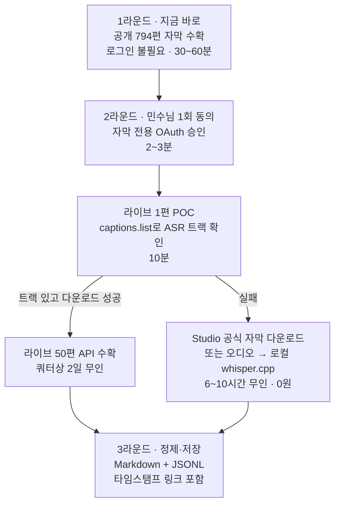

# 메이크패밀리 유튜브 전체 전사 — 실행안

작성: 2026-08-05
근거: PLAUD 회의 원문 + yt-dlp 실측 + 공식 문서 확인 + AI 친구들(Gemini 3.6 / GPT-5.6 Sol) 교차 의견

---

## 결정 박스

**질문**: 메이크패밀리 유튜브 844편(약 86시간)을 전사본으로 확보하는 작업, "공개분은 지금 바로 / 멤버십분은 공식 API"로 갈까요?

**추천: YES**

| | |
|---|---|
| **핵심 근거 1** | 유튜브가 이미 만들어 놓은 한국어 자동자막이 있다. 10편 실측 결과 **42초·성공률 100%·문장부호까지 정상**. 새로 전사할 이유가 없다 |
| **핵심 근거 2** | 공개 영상 794편(33시간)은 **로그인 자체가 필요 없다**. 계정을 안 쓰므로 채널 제재 위험이 구조적으로 0이다. 승인만 하면 오늘 끝난다 |
| **핵심 근거 3** | 나머지 53.6시간(멤버십 라이브)은 **공식 YouTube Data API로 받는다**. 자동생성(ASR) 자막은 공식 문서에 정식 트랙 종류로 명시돼 있고, 다운로드 제외 조건이 없다 |
| **가장 큰 반대 근거** | 멤버십 라이브에 자동자막이 실제로 붙어 있는지, API가 그 채널에서 실제로 내려주는지는 **아직 실측 전**이다. 둘 다 실패하면 53.6시간을 로컬 Whisper로 돌려야 하고 6~10시간(무인)이 든다 |
| **승인 시** | 1라운드 공개 794편 무인 수확(30~60분). 민수님 액션은 1건 — 자막 전용 OAuth 1회 동의(2~3분) |
| **거절 시** | 공개분 145편 27.5시간만 확보. 정작 자료 가치가 높은 라이브 강의 53.6시간이 통째로 빠진다 |

**비용**: 0원 (전부 무료·로컬 도구). 외부 유료 API 없음.

**중요한 방향 수정**: 처음엔 "소유 계정 쿠키 + yt-dlp"가 가장 빠르다고 봤는데, GPT-5.6이 이를 정면으로 반박했고 **공식 문서 확인 결과 GPT가 맞았습니다**. 자세한 내용은 5장.

---

## 1. 요청 원문 — 찾았습니다

**2026-08-03 「AI 기반 사업 전략 및 운영 효율화 회의」 [58:56 ~ 59:26]**

> **Speaker 1**: (전자책 재활용 얘기 중) …여기서 최신 버전으로 링크나 이런 부분만 수정하면 될 것 같고 **그래서 그거 요청하면 되고 저희 유튜브.**
> **민수**: **네, 전체 전사 그거 오늘하고 내일 해가지고 그게 양이 너무 많아서** 맞아요 그거 조금 걸릴 것 같긴.
> **Speaker 1**: 해요 **라이브 영상들이 좀.**
> **민수**: 알겠습니다 해보겠습니다.

**맥락**: 바로 앞이 "노션에 쌓인 자료를 전자책 여러 권으로 묶자"는 논의다.
즉 **유튜브 전체 전사 = 전자책·가이드북 재활용을 위한 원본 소스 확보**가 목적이다.
그 자리에서 이미 **라이브가 병목**이라고 정확히 짚혀 있었다.

**확인 범위**: 07-20 / 07-23(2건) / 07-27 / 07-31 / 08-03 / 08-04 회의 전문을 전부 검색했다.
유튜브 전사 요청은 **08-03 이 한 건뿐**이고, 저번주 회의에는 없다.

**주의**: PLAUD 화자 분리가 이 구간에서 상철님과 동규 대표를 모두 `Speaker 1`로 뭉뚱그렸다.
앞뒤 맥락(전자책 제작 담당이 상철님)상 상철님 발언일 가능성이 높지만 원문만으로는 확정할 수 없다.
다만 민수님이 "해보겠습니다"로 받은 것은 확정이다.

---

## 2. 채널 실측 (2026-08-05, yt-dlp 직접 측정)

채널: `youtube.com/@메이크패밀리` (`UCfLllxOn8hbOqwVFYw5L-PQ`)

| 구분 | 편수 | 총 길이 | 공개 여부 | 자동자막 | 난이도 |
|---|---:|---:|---|---|---|
| 일반 영상 | 145 | 27.5시간 | 공개 | 있음 (샘플 10/10) | 쉬움 |
| 쇼츠 | 649 | 약 5.4시간 (추정) | 공개 | 대부분 있음 (샘플 5/6) | 쉬움 |
| **라이브 다시보기** | **50** | **53.6시간** | **멤버십 전용** | **확인 불가** | **여기가 전부** |
| 합계 | 844 | 약 86시간 | | | |

분량 기준으로 **라이브가 62%**다. 회의에서 나온 "라이브 영상들이 좀…"이 정확했다.

### 실측 검증 결과

| 테스트 | 결과 |
|---|---|
| 공개 영상 10편 자막 수확 | **42초, 10/10 성공, 3.4MB** |
| 자막 품질 | 문장부호·띄어쓰기 정상. 바로 쓸 수 있는 수준 |
| 로그인 없이 멤버십 영상 | 접근 불가 (예상대로) |
| 민수님 기본 크롬 프로필 쿠키로 시도 | 쿠키 329개는 읽혔지만 여전히 거부. 기본 프로필은 채널 소유·멤버 계정이 아님 |

자막 품질 샘플 (「상위 1% 크리에이터들이 숨기는 콘텐츠 발굴」):

> "여러분 더 이상 레퍼런스 찾으러 돌아다니지 마세요. 유튜브, 인스타, 틱톡, 쓰레드 X 원하는 키워드만 설정해 두면 잘 터진 콘텐츠를 한 번에 만나 보실 수 있습니다…"

---

## 3. 권장 경로



### 왜 이 순서인가

1. **1라운드는 민수님을 기다릴 이유가 없다.** 794편은 로그인 없이 익명으로 받는다. 계정을 안 쓰니 채널 제재 위험이 구조적으로 존재하지 않는다.
2. **2라운드는 "빠른 길"이 아니라 "안전한 길"을 고른다.** 주 수익 채널이 걸린 판에서는 속도 5분 차이보다 공식 경로냐가 중요하다.
3. **POC 1편이 전체 일정을 정한다.** 성공하면 총 이틀 무인, 실패하면 하룻밤 Whisper. 어느 쪽이든 민수님 손은 안 간다.
4. **whisper는 폴백이지 기본이 아니다.** 이미 있는 자막을 두고 GPU를 6~10시간 돌리는 건 낭비다.

---

## 4. 후보 경로 비교

| 경로 | 채널 제재 위험 | 소요 | 실패 지점 | 판정 |
|---|---|---|---|---|
| **익명 yt-dlp (공개분 794편)** | **없음** — 계정·쿠키를 아예 안 씀 | 30~60분 | IP 단위 일시 제한 정도 | **공개분 1순위** |
| **공식 Data API `captions.download`** | **최저** — 공식·쿼터 내 | POC 10분, 전체 2일 | OAuth 채널 불일치, ASR 트랙 부재, 쿼터 | **멤버십분 1순위** |
| **YouTube Studio 공식 자막 다운로드** | 낮음 | 수작업 30~90분 | 반복 클릭(민수님이 제일 싫어하는 형태) | API 실패 시 2순위 |
| **오디오 + 로컬 whisper.cpp** | 낮음 (원본·Studio 경유 시) | 6~10시간 무인 | 자막이 실제로 없을 때만 정당화 | 폴백 |
| **소유 계정 쿠키 + yt-dlp** | 확률은 낮지만 **결과가 치명적** | 5~15분 | 쿠키 만료, PO Token, 계정 제한 | **최후 수단** |
| **외부 전사 API (OpenAI 등)** | 없음 | 1~2시간, 약 $19 | 라이브에 수강생 실명·질문이 섞임. 회사 규칙상 고객 대화 원문 외부 전송 금지 | **제외** |

### 쿼터 계산

라이브 1편당 `captions.list` 50유닛 + `captions.download` 200유닛 = **250유닛**.
50편이면 12,500유닛인데 기본 일 할당량은 10,000이다.
따라서 **1일차 40편 / 2일차 10편**으로 나눈다. 무인이라 체감 부담은 없다.

### 스코프 주의

`youtube.force-ssl`은 이름과 달리 읽기 전용이 아니다.
**영상·댓글·자막을 편집하고 영구 삭제할 수 있는 넓은 권한**이다.

- 기존 라이브 재업로드용 토큰(`youtube.upload` + `youtube.readonly`)에 덧붙이지 않는다
- **자막 수확 전용 OAuth 클라이언트를 따로 만들고, 작업이 끝나면 토큰을 폐기한다**
- 토큰은 Keychain에만 두고 로그·대화·파일에 노출하지 않는다

---

## 5. AI 친구들 종합의견

브리핑은 동일 조건(실측 수치 + 제약)으로 Gemini 3.6 Flash High와 GPT-5.6 Sol(high)에 각각 보냈습니다.
회의 원문·수강생 정보는 전달하지 않았고, 기술 조건만 요약해 보냈습니다.

### 합의한 지점

| 항목 | 두 모델 공통 결론 |
|---|---|
| 재전사 여부 | 53.6시간을 Whisper로 새로 돌리는 건 낭비. **기존 자막이 본문 원본** |
| 화자분리 | 강사 1인 전달이 대부분이라 전면 도입 불필요. **필요한 라이브만 선별** |
| 저장 구조 | 원본(raw)은 손대지 않고 보존 + 정제본을 Markdown/JSONL로 분리 |
| 인용 방식 | `video_id + 시작시각`으로 유튜브 타임스탬프 링크 생성 |
| 접근 등급 | `members_only` 플래그가 필수. 재활용 단계에서 걸러야 함 |

### 갈린 지점 — 그리고 누가 맞았나

**쟁점: 멤버십 라이브를 어떻게 받을 것인가**

| | Gemini 3.6 | GPT-5.6 Sol |
|---|---|---|
| 1순위 | 소유 계정 쿠키 + yt-dlp (1분이면 끝) | 공식 Data API (POC 후 전체) |
| 공식 API 평가 | "ASR은 API로 다운로드 **불가**. `cannotDownloadAutoGeneratedCaptionTrack` 403" | "공식 계약상 **가능**. ASR은 정식 trackKind" |
| 쿠키 방식 위험 | "자막만 받으므로 밴 리스크 사실상 0" | "요청량이 아니라 **인증 계정으로 비공식 자동 접근한다는 사실**이 문제" |

**직접 확인한 결과 — GPT가 맞습니다.**

1. Gemini가 근거로 든 에러 코드 `cannotDownloadAutoGeneratedCaptionTrack`은 **공식 문서에 존재하지 않습니다.** `captions.download`의 문서화된 오류는 `forbidden` / `couldNotConvert` / `captionNotFound` 세 개뿐입니다.
2. `snippet.trackKind`의 정식 값에 **`ASR`("자동 음성 인식으로 생성된 자막 트랙")이 명시**돼 있습니다. 다운로드에서 ASR을 제외한다는 조항은 없습니다.
3. 즉 Gemini의 결론은 그럴듯하지만 **없는 근거 위에 서 있었습니다.**

**밴 리스크 판단도 GPT 쪽이 낫습니다.** "자막은 몇 KB라 안전하다"는 트래픽 양 기준의 논리인데, 실제 제재는 인증된 계정의 자동화된 비공식 접근을 보고 걸립니다. 확률이 낮아도 **주 수익 채널이 날아가면 복구가 안 됩니다.** 5분 아끼자고 걸 판이 아닙니다.

### GPT가 추가로 짚은 것 (제가 놓쳤던 것)

- **YouTube Studio에도 공식 자막 다운로드가 있다.** API가 막혀도 수작업 폴백이 존재한다
- **자막이 없는 라이브는 yt-dlp보다 먼저 로컬 녹화본·OBS 원본을 찾아라.** 다시 받을 이유가 없을 수 있다
- **"전부 같은 처리"를 버려라.** 전량 수확 → 품질 자동 검사 → 문제 있는 것만 재전사 → 다화자 고가치만 화자분리

### 제 독립 판단

두 모델 다 놓친 게 하나 있습니다. **1라운드 공개 794편은 어느 쪽 논쟁과도 무관합니다.**
로그인이 필요 없으니 계정 위험도, 쿼터도, OAuth 동의도 없습니다.
두 모델은 어려운 38%(라이브)만 보느라 쉬운 62%(편수 기준)를 지금 당장 끝낼 수 있다는 걸 제안하지 않았습니다.

그리고 Gemini가 "1분이면 끝"이라고 한 건 **틀린 게 아니라 위험한 것**입니다.
빠른 게 사실이어도, 실패 시 손실이 비대칭이면 그 경로는 선택지에서 내려야 합니다.

---

## 6. 저장 구조 (재활용까지 고려)

```text
transcripts/
├── manifest.jsonl        # 전체 목록·수확 상태
├── raw/{video_id}/       # yt-dlp·API 원본 — 절대 수정하지 않음
├── clean/
│   ├── md/               # 전자책·블로그 재활용용 (문단 + 타임스탬프 헤딩)
│   └── jsonl/            # AI 검색·인용용 (세그먼트 단위)
```

Markdown 프론트매터 최소 필드:

```yaml
video_id: TtS525AJIIA
title: 상위 1% 크리에이터들이 숨기는 콘텐츠 발굴
url: https://youtu.be/TtS525AJIIA
published: 2026-07-30
type: video | shorts | live
access_tier: public | members_only
reuse_policy: open | internal_only
duration_sec: 1700
source: youtube_asr_ytdlp | youtube_asr_api | whisper_local
pii_status: unreviewed | masked | reviewed
```

세 필드가 핵심입니다.

- **`access_tier`** — 멤버십 전용 라이브 내용을 무료 자료로 그대로 내보내면 유료 멤버십의 가치가 무너진다
- **`source`** — 나중에 "이 문장이 자동자막 오인식인지 Whisper 결과인지"를 판별하는 근거가 된다
- **`pii_status`** — 기본값을 `unreviewed`로 두고, 검수 전에는 외부로 못 나가게 막는다

---

## 7. 민수님 액션 (1건, 2~3분)

**지금은 아무것도 안 하셔도 됩니다.** 1라운드(공개 794편)는 승인만 있으면 무인으로 끝납니다.

2라운드 진입 시 필요한 것 하나:

1. 제가 자막 전용 OAuth 동의 URL을 하나 만들어 드립니다
2. 브라우저에서 **메이크패밀리 채널을 소유한 구글 계정**으로 1회 승인
3. 화면에 뜬 코드를 붙여넣기

작업이 끝나면 해당 토큰은 폐기합니다.

---

## 8. 남은 리스크

| 리스크 | 대응 |
|---|---|
| 멤버십 라이브에 자동자막이 없을 수 있음 | POC 1편으로 10분 안에 판명. 없으면 whisper 폴백(6~10시간 무인) |
| API가 그 채널에서 ASR을 안 내줄 수 있음 | 공식 문서상 제외 조항 없음. 그래도 미실측이라 POC 필수. 실패 시 Studio 경로 |
| `force-ssl`이 삭제 권한까지 포함 | 전용 OAuth 클라이언트 분리 + 작업 후 토큰 폐기 |
| OAuth 동의화면이 Testing이면 토큰 7일 만료 | 일회성 작업이라 무관. 이틀이면 끝 |
| 라이브 자막에 수강생 실명·질문 포함 | 정제 단계에서 로컬 정규식 마스킹. 원문은 외부 모델·노션·깃허브로 내보내지 않음 |
| yt-dlp 버전이 2026.03.17로 90일 이상 경과 | 수확 전 업데이트 1회 |
| 멤버십 콘텐츠의 무료 재활용 | `access_tier` + `reuse_policy`로 차단 |

---

<details>
<summary>원자료 · 검증 로그</summary>

### 실행한 검증 명령

```bash
# 채널 목록
yt-dlp --flat-playlist --dump-json "https://www.youtube.com/@메이크패밀리/videos"   # 145
yt-dlp --flat-playlist --dump-json "https://www.youtube.com/@메이크패밀리/streams"  # 50
yt-dlp --flat-playlist --dump-json "https://www.youtube.com/@메이크패밀리/shorts"   # 649

# 자막 존재 확인 (샘플)
yt-dlp --list-subs --skip-download "https://www.youtube.com/watch?v=<ID>"

# 10편 수확 실측 (42초)
yt-dlp --skip-download --write-auto-subs --sub-langs ko-orig \
       --sleep-requests 1 -a ids10.txt
```

### 라이브 50편 중 샘플 12편 판정

전부 `Join this channel to get access to members-only content` — 멤버십 전용.
별도 1편은 `This live event will begin in 29 hours` (예정된 라이브).

### 공식 문서 확인 (Gemini 주장 반증)

- `captions.download` 문서화된 오류: `forbidden`(403), `couldNotConvert`(400), `captionNotFound`(404) — **ASR 전용 오류 없음**
- `captions.list` 필요 스코프: `youtube.force-ssl`, `youtubepartner` — **기존 `youtube.readonly` 토큰으로는 불가**
- `snippet.trackKind` 정식 값: `ASR`, `forced`, `standard`

### 기존 자산 (재사용 가능)

- `~/Projects/youtube/make-youtube-automation` — 해당 채널 OAuth 클라이언트·토큰 보유 (`youtube.upload` + `youtube.readonly`)
- 이 워크스페이스 서버 — yt-dlp 래핑 + `--cookies-from-browser` 자동 감지 + 403 시 쿠키 없이 재시도 로직

### 참고한 웹 자료

- [yt-dlp PO Token Guide](https://github.com/yt-dlp/yt-dlp/wiki/PO-Token-Guide) — 쿠키 사용 시 계정 제한 위험, 대량 다운로드가 플래그 1순위
- [yt-dlp Extractors Wiki](https://github.com/yt-dlp/yt-dlp/wiki/Extractors) — 계정 쿠키 사용 경고
- [YouTube Data API — Captions](https://developers.google.com/youtube/v3/docs/captions) — trackKind ASR 정의
- [YouTube Data API — Captions: download](https://developers.google.com/youtube/v3/docs/captions/download) — 오류 코드 3종
- [YouTube Data API — Captions: list](https://developers.google.com/youtube/v3/docs/captions/list) — 필요 스코프
- [YouTube API Quota 2026](https://www.socialcrawl.dev/blog/youtube-data-api-2026) — 일 할당량 10,000
- [Self-Hosted Whisper 2026](https://www.digitalapplied.com/blog/local-speech-to-text-whisper-self-hosted-transcription-2026) — Apple Silicon은 whisper.cpp/MLX 경로
- [SenseVoice vs Whisper (CJK)](https://whispernotes.app/blog/sensevoice-fastest-cjk-transcription) — Parakeet은 한국어 미지원
- [WhisperX](https://github.com/m-bain/whisperX) · [pyannote-audio](https://github.com/pyannote/pyannote-audio) — 화자분리가 필요한 라이브 한정
- [bulk_transcribe_youtube_videos_from_playlist](https://github.com/Dicklesworthstone/bulk_transcribe_youtube_videos_from_playlist) — 오픈소스 참고 구현
- [How to Archive & Transcribe YouTube Videos in Bulk](https://blog.lopp.net/how-to-archive-transcribe-youtube-videos-bulk/)
- [YouTube Studio 자막 다운로드](https://support.google.com/youtube/answer/2734705) · [소유 영상 다운로드](https://support.google.com/youtube/answer/56100)

</details>
