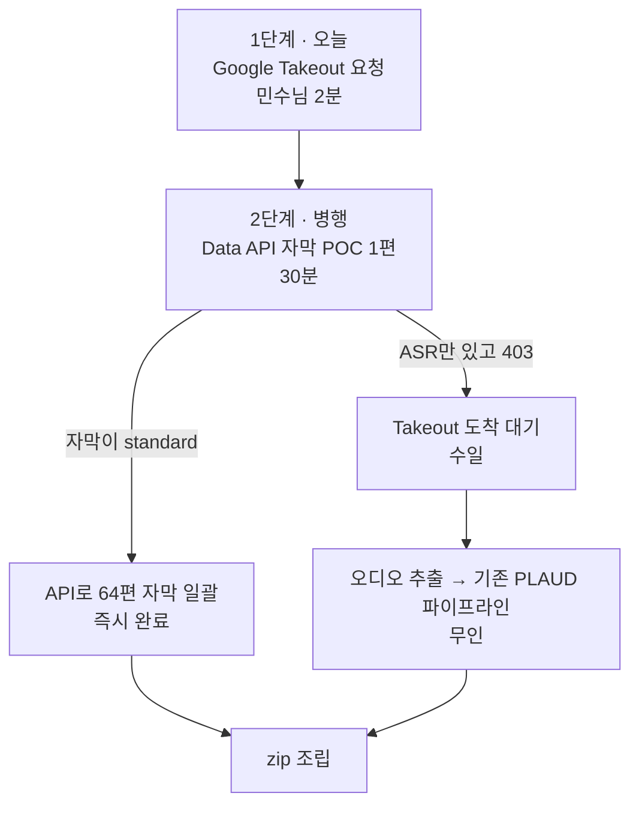

# 멤버십·라이브 64편 — 해결방안 조사

작성: 2026-08-13
대상: 멤버십 전용 라이브 49편(53.6h) + 일반영상 탭의 멤버십 15편
근거: 웹 조사 + AI 친구들(Gemini 3.6 / GPT-5.6 Sol) 교차 + 공식 문서 확인

---

## 결정 박스

**질문**: 5번 실패한 브라우저 로그인을 계속 시도할까요, 아니면 다른 경로로 갈까요?

**추천: Google Takeout으로 전환. 로그인 시도는 중단**

| | |
|---|---|
| **핵심 근거 1** | **우리는 자막이 아니라 오디오만 있으면 됩니다.** PLAUD 전사 파이프라인이 이미 완성돼 있습니다. Takeout은 자기가 업로드한 영상 전체를 공식 경로로 내려줍니다 |
| **핵심 근거 2** | 제재 위험이 **구조적으로 0**입니다. 구글 공식 백업 기능이라 쿠키도, 자동화 브라우저도, 로그인 세션도 필요 없습니다. 5번 막힌 벽을 통째로 우회합니다 |
| **핵심 근거 3** | 민수님 개입이 **2회**로 끝납니다. Takeout 요청 1회, 다운로드 링크 수령 1회. 그 뒤는 기존 파이프라인이 처리합니다 |
| **가장 큰 반대 근거** | **멤버십 영상이 실제로 포함되는지 미확인**입니다. 구글은 "업로드한 영상 전체"라고만 안내하고 멤버십 전용을 별도로 명시하지 않습니다. 아카이브를 받아봐야 압니다 |
| **두 번째 단점** | 영상별 선택이 안 됩니다. 채널 전체(쇼츠 649편 포함)가 오므로 아카이브가 큽니다. 며칠 걸릴 수 있습니다 |
| **병행할 것** | Data API 자막 POC 1편 — 30분. 자막이 `standard` 종류면 Takeout 없이 즉시 끝납니다 |

**배제한 것**: Firefox 쿠키, 일시적 일부공개 전환, ABE 복호화 도구. 이유는 4장.

---

## 1. 지금까지 막힌 지점 (실측)

| 시도 | 결과 |
|---|---|
| `yt-dlp --cookies-from-browser edge` | `Failed to decrypt with DPAPI` — Edge App-Bound Encryption |
| 작업 스케줄러(사용자 세션)에서 동일 실행 | 동일 실패 |
| 전용 프로필에 직접 로그인 | **5회 시도, 전부 세션 미저장** |
| 맥 Edge (8/5에는 성공) | 지금은 거부 |

**5회 실패의 원인**은 두 가지가 겹친 것으로 보입니다.

- `msedge.exe --user-data-dir=...`는 Edge가 이미 실행 중이면 **무시**됩니다. 로그인이 기본 프로필로 갔습니다
- Playwright로 띄운 창은 **구글이 자동화 브라우저 로그인을 차단**합니다. 구글 공식 문서에 명시된 정책입니다

---

## 2. AI 친구들이 갈린 지점

동일 조건으로 Gemini 3.6과 GPT-5.6 Sol에 브리핑했습니다. 결론이 정면으로 갈렸습니다.

| 쟁점 | Gemini | GPT-5.6 |
|---|---|---|
| **Firefox + yt-dlp** | 최우선 추천, 제재 위험 **0%** | **제외**, 계정 위험 높음 |
| **일시적 일부공개 전환** | 최우선 추천, 위험 **0%** | **제외**, 콘텐츠 유출·회원 신뢰 위험 |
| **Data API ASR 자막** | 불가능 (0%) | 불확실 — 1편 POC 필요 |
| **Takeout 자막 포함** | 미포함 | 미포함 (스키마에 caption 객체 없음) |

### 제 판단: GPT 쪽이 맞습니다

**Firefox**: Gemini는 "위험 0%"라고 했지만 근거가 없습니다. yt-dlp 공식 위키가 **"로그인 계정이 일시적 또는 영구 정지될 수 있다"**고 직접 경고합니다. 쿠키 추출 문제는 풀리지만 **계정 위험은 그대로**입니다. 주 수익 채널에 쓸 카드가 아닙니다.

**일부공개 전환**: 이게 가장 위험합니다. Gemini는 "심야에 1~2시간이면 노출 위험 없다"고 했는데 — 그 사이 제3자가 받아갈 수 있고, **유료 멤버십 콘텐츠를 잠시라도 공개하는 것 자체가 회원과의 약속을 깨는 일**입니다. 되돌리기 실수라도 나면 64편이 공개된 채 남습니다. 기술적으로 되는 것과 해도 되는 것은 다릅니다.

**ASR 자막**: 8월 5일 조사 때도 Gemini가 존재하지 않는 에러 코드를 근거로 들었던 전력이 있습니다. 이번에도 "0%" 단정인데, 공식 문서는 `trackKind=ASR`을 정식 값으로 정의합니다. **POC 1편으로 30분이면 확정**되므로 단정하지 말고 확인하는 게 맞습니다.

---

## 3. 권장 경로

### 왜 이 순서인가

1. **Takeout은 시간이 걸리므로 먼저 걸어둡니다.** 아카이브 생성에 수 시간~수일이 걸립니다. 기다리는 동안 다른 걸 시도하면 됩니다.
2. **API POC가 짧은 우회로입니다.** 자막이 `standard` 종류면 Takeout이 필요 없습니다. 30분이면 판명됩니다.
3. **어느 쪽이든 기존 파이프라인에 얹힙니다.** 오디오만 확보되면 PLAUD 업로드·전사·회수는 이미 검증된 경로입니다.

### Takeout 실행 시 주의

- **브랜드 계정으로 전환한 뒤** 요청해야 합니다. 개인 계정으로 요청하면 메이크패밀리 영상이 안 옵니다
- 첫 아카이브를 받으면 **멤버십 영상 1편이 실제로 있는지부터 확인**합니다. 없으면 이 경로는 종료입니다
- 채널 전체가 오므로 용량이 큽니다. 필요한 64편만 골라 쓰면 됩니다

---

## 4. 배제한 방안과 이유

| 방안 | 배제 이유 |
|---|---|
| **Firefox 쿠키 + yt-dlp** | 쿠키 추출은 되지만 yt-dlp 공식 경고대로 **계정 정지 위험**이 남습니다. 주 수익 채널에는 부적합 |
| **일시적 일부공개 전환** | 유료 멤버십 콘텐츠 유출 + 되돌리기 실패 시 대형 사고. 회원 신뢰 문제 |
| **ABE 엔터프라이즈 정책 끄기** | 브라우저 전체 보안이 약해집니다. 게다가 **이미 암호화된 쿠키는 소급 복호화 불가**라 새 프로필 재로그인이 또 필요합니다 |
| **ABE 복호화 오픈소스** | 프로세스 주입·EDR 회피를 쓰는 사실상 공격 도구입니다. 회사 PC에서 실행하면 안 됩니다 |
| **Studio DOM 자동화 (64회 클릭)** | 기술적으론 되지만 유튜브 약관이 사전 허가 없는 자동화 접근을 제한합니다 |

---

## 5. 장기 개선안 (GPT 제안 중 채택)

**채널 권한 위임**입니다. 대표 계정을 자동화 PC에 직접 넣지 않는 방법입니다.

1. 전용 구글 계정을 하나 만듭니다
2. YouTube Studio에서 그 계정에 **`Subtitle Editor`** 또는 `Editor (Limited)` 권한을 부여합니다
3. 자동화 PC에는 그 전용 계정만 로그인시킵니다

비밀번호 공유보다 안전하고, 사고가 나도 권한 회수로 끝납니다. 다만 **채널 권한 사용자는 YouTube API를 쓸 수 없어서**, API 경로는 여전히 소유자 OAuth가 필요합니다.

---

## 6. 현재 진행 상황

| | |
|---|---|
| 일반영상 | **120/145편** (22.0h / 27.5h) |
| 라이브 | 0/49편 |
| 남은 일반영상 25편 | 멤버십 15편 + 재시도 대상 10편 |

재시도 중 서버가 두 번 죽었습니다. 차단기가 작동해 큐를 태우지는 않았고, 재기동 후 계속 돌고 있습니다. 서버 사망 원인은 아직 확정하지 못했습니다.

---

## 7. 민수님 결정 사항

1. **Google Takeout을 요청할까요?** (2분, takeout.google.com에서 브랜드 계정 전환 후 YouTube 선택)
2. **Data API 자막 POC를 돌릴까요?** (제가 진행, `youtube.force-ssl` 스코프 1회 동의 필요)

둘 다 병행이 가능하고 서로 방해하지 않습니다.

---

원자료 · 참고 링크

### 공식 문서

- [Chrome App-Bound Encryption 정책](https://chromeenterprise.google/policies/application-bound-encryption-enabled/) · [Edge 정책](https://learn.microsoft.com/en-us/deployedge/microsoft-edge-browser-policies/applicationboundencryptionenabled)
- [Google 지원 브라우저 정책](https://support.google.com/accounts/answer/7675428) — 자동화 브라우저 로그인 차단 명시
- [YouTube Data API — captions.download](https://developers.google.com/youtube/v3/docs/captions/download) · [captions 리소스](https://developers.google.com/youtube/v3/docs/captions)
- [Google Takeout 안내](https://support.google.com/accounts/answer/3024190) · [YouTube 내보내기 스키마](https://developers.google.com/data-portability/schema-reference/youtube)
- [업로드 영상 다운로드](https://support.google.com/youtube/answer/56100) · [Studio 자막 편집](https://support.google.com/youtube/answer/2734705)
- [채널 권한 역할](https://support.google.com/youtube/answer/9481328)
- [Desktop OAuth loopback flow](https://developers.google.com/identity/protocols/oauth2/native-app)

### 커뮤니티·오픈소스

- [yt-dlp #10927 DPAPI 실패](https://github.com/yt-dlp/yt-dlp/issues/10927) · [#15401 v20 쿠키](https://github.com/yt-dlp/yt-dlp/issues/15401) · [#7271 DB 잠금](https://github.com/yt-dlp/yt-dlp/issues/7271)
- [yt-dlp Extractors 위키](https://github.com/yt-dlp/yt-dlp/wiki/Extractors) — 계정 정지 위험 경고
- [6 Ways to Get YouTube Cookies for yt-dlp in 2026](https://dev.to/osovsky/6-ways-to-get-youtube-cookies-for-yt-dlp-in-2026-only-1-works-2cnb) — Firefox만 동작한다는 분석
- [youtube-transcript-api](https://github.com/jdepoix/youtube-transcript-api) — 2026-01 브라우저 쿠키 인증 PR 추가. 다만 멤버십 영상은 미지원 명시
- [Chrome-App-Bound-Encryption-Decryption](https://github.com/xaitax/Chrome-App-Bound-Encryption-Decryption) — 프로세스 주입 방식. **사용 금지 판정**

